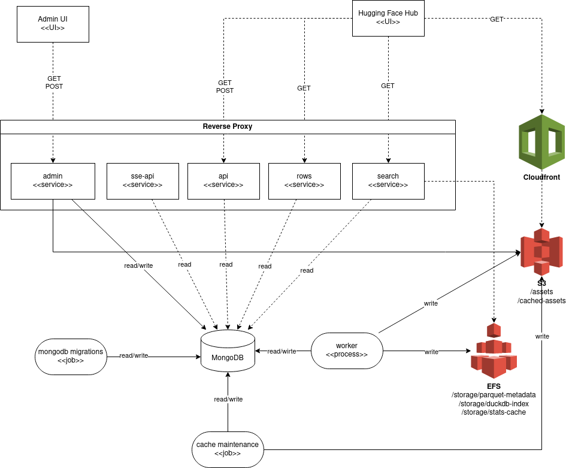

# Developer guide

This document is intended for developers who want to install, test or contribute to the code.

## Install

To start working on the project:

```bash
git clone git@github.com:huggingface/dataset-viewer.git
cd dataset-viewer
```

Install docker (see https://docs.docker.com/engine/install/ubuntu/#install-using-the-repository and https://docs.docker.com/engine/install/linux-postinstall/)

Run the project locally:

```bash
make start
```

Run the project in development mode:

```bash
make dev-start
```

In development mode, you don't need to rebuild the docker images to apply a change in a worker.
You can just restart the worker's docker container and it will apply your changes.

To install a single job (in [jobs](./jobs)), library (in [libs](./libs)) or service (in [services](./services)), go to their respective directory, and install Python 3.9 (consider [pyenv](https://github.com/pyenv/pyenv)) and [poetry](https://python-poetry.org/docs/master/#installation) (don't forget to add `poetry` to the `PATH` environment variable).

If you use pyenv:

```bash
cd libs/libcommon/
pyenv install 3.9.18
pyenv local 3.9.18
poetry env use python3.9
```

then:

```bash
make install
```

It will create a virtual environment in a `./.venv/` subdirectory.

If you use VSCode, it might be useful to use the ["monorepo" workspace](./.vscode/monorepo.code-workspace) (see a [blogpost](https://medium.com/rewrite-tech/visual-studio-code-tips-for-monorepo-development-with-multi-root-workspaces-and-extension-6b69420ecd12) for more explanations). It is a multi-root workspace, with one folder for each library and service (note that we hide them from the ROOT to avoid editing there). Each folder has its own Python interpreter, with access to the dependencies installed by Poetry. You might have to manually select the interpreter in every folder though on first access, then VSCode stores the information in its local storage.

## Architecture

The repository is structured as a monorepo, with Python libraries and applications in [jobs](./jobs), [libs](./libs) and [services](./services):

The following diagram represents the general architecture of the project:


- [Mongo Server](https://www.mongodb.com/), a Mongo server with databases for: "cache", "queue" and "maintenance".
- [jobs](./jobs) contains the jobs run by Helm before deploying the pods or scheduled basis.
For now there are two type of jobs:
    - [cache maintenance](./jobs/cache_maintenance/)
    - [mongodb migrations](./jobs/mongodb_migration/)
- [libs](./libs) contains the Python libraries used by the services and workers. 
For now, there are two libraries 
    - [libcommon](./libs/libcommon), which contains the common code for the services and workers.
    - [libapi](./libs/libapi/), which contains common code for authentication, http requests, exceptions and other utilities for the services.
- [services](./services) contains the applications: 
    - [api](./services/api/), the public API, is a web server that exposes the [API endpoints](https://huggingface.co/docs/datasets-server). All the responses are served from pre-computed responses in Mongo server. That's the main point of this project: generating these responses takes time, and the API server provides this service to the users.
    - [webhook](./services/webhook/), exposes the `/webhook` endpoint which is called by the Hub on every creation, update or deletion of a dataset on the Hub. On deletion, the cached responses   are deleted. On creation or update, a new job is appended in the "queue" database.
    - [rows](./services/rows/)
    - [search](./services/search/)
    - [admin](./services/admin/), the admin API (which is separated from the public API and might be published under its own domain at some point)
    - [reverse proxy](./services/reverse-proxy/) the reverse proxy
    - [worker](./services/worker/) the worker that processes the queue asynchronously: it gets a "job" collection (caution: the jobs stored in the queue, not the Helm jobs), processes the expected response for the associated endpoint, and stores the response in the "cache" collection.
    Note also that the workers create local files when the dataset contains images or audios. A shared directory (`ASSETS_STORAGE_ROOT`) must therefore be provisioned with sufficient space for the generated files. The `/first-rows` endpoint responses contain URLs to these files, served by the API under the `/assets/` endpoint.
    - [sse-api](./services/sse-api/)
- Clients
    - [Admin UI](./front/admin_ui/)
    - [Hugging Face Hub](https://huggingface.co/) 

If you have access to the internal HF notion, see https://www.notion.so/huggingface2/Datasets-server-464848da2a984e999c540a4aa7f0ece5.

Hence, the working application has the following core components:

- a Mongo server with two main databases: "cache" and "queue"
- one instance of the API service which exposes a port
- one instance of the ROWS service which exposes a port
- one instance of the SEARCH service which exposes a port
- N instances of worker that processes the pending "jobs" and stores the results in the "cache"

The application also has optional components:

- a reverse proxy in front of the API to serve static files and proxy the rest to the API server
- an admin server to serve technical endpoints
- a shared directory for the assets and cached-assets in [S3](https://aws.amazon.com/s3/) (It can be configured to point to a local storage instead)
- a shared storage for temporal files created by the workers in [EFS](https://aws.amazon.com/efs/) (It can be configured to point to a local storage instead)


The following environments contain all the modules: reverse proxy, API server, admin API server, workers, and the Mongo database.

| Environment | URL                                                  | Type              | How to deploy                           |
| ----------- | ---------------------------------------------------- | ----------------- | --------------------------------------- |
| Production  | https://datasets-server.huggingface.co               | Helm / Kubernetes | `make upgrade-prod` in [chart](./chart) |
| Development | https://datasets-server.us.dev.moon.huggingface.tech | Helm / Kubernetes | `make upgrade-dev` in [chart](./chart)  |
| Local build | http://localhost:8100                                | Docker compose    | `make start` (builds docker images)     |

## Quality

The CI checks the quality of the code through a [GitHub action](./.github/workflows/_quality-python.yml). To manually format the code of a job, library, service or worker:

```bash
make style
```

To check the quality (which includes checking the style, but also security vulnerabilities):

```bash
make quality
```

## Tests

The CI checks the tests a [GitHub action](./.github/workflows/unit-tests.yml). To manually test a job, library, service or worker:

```bash
make test
```

Note that it requires the resources to be ready, ie. mongo and the storage for assets.

To launch the end to end tests:

```bash
make e2e
```

## Poetry

### Versions

If service is updated, we don't update its version in the `pyproject.yaml` file. But we have to update the [helm chart](./chart/) with the new image tag, corresponding to the last build docker published on docker.io by the CI.

## Pull requests

All the contributions should go through a pull request. The pull requests must be "squashed" (ie: one commit per pull request).

## GitHub Actions

You can use [act](https://github.com/nektos/act) to test the GitHub Actions (see [.github/workflows/](.github/workflows/)) locally. It reduces the retroaction loop when working on the GitHub Actions, avoid polluting the branches with empty pushes only meant to trigger the CI, and allows to only run specific actions.

For example, to launch the build and push of the docker images to Docker Hub:

```
act -j build-and-push-image-to-docker-hub --secret-file my.secrets
```

with `my.secrets` a file with the secrets:

```
DOCKERHUB_USERNAME=xxx
DOCKERHUB_PASSWORD=xxx
GITHUB_TOKEN=xxx
```

## Set up development environment

### Linux

Install pyenv:

```bash
$ curl https://pyenv.run | bash
```

Install Python 3.9.18:

```bash
$ pyenv install 3.9.18
```

Check that the expected local version of Python is used:

```bash
$ cd services/worker
$ python --version
Python 3.9.18
```

Install Poetry with [pipx](https://pipx.pypa.io/stable/installation/):

- Either a single version:
```bash
pipx install poetry==1.8.2
poetry --version
```
- Or a parallel version (with a unique suffix):
```bash
pipx install poetry==1.8.2 --suffix=@1.8.2
poetry@1.8.2 --version
```

Set the Python version to use with Poetry:

```bash
poetry env use 3.9.18
```
or
```bash
poetry@1.8.2 env use 3.9.18
```

Install the dependencies:

```bash
make install
```


### Mac OS

To install the [worker](./services/worker) on Mac OS, you can follow the next steps.

#### First: as an administrator

Install brew:

```bash
$ /bin/bash -c "$(curl -fsSL https://raw.githubusercontent.com/Homebrew/install/HEAD/install.sh)"
```

#### Then: as a normal user

Install pyenv:

```bash
$ curl https://pyenv.run | bash
```

append the following lines to ~/.zshrc:

```bash
export PYENV_ROOT="$HOME/.pyenv"
command -v pyenv >/dev/null || export PATH="$PYENV_ROOT/bin:$PATH"
eval "$(pyenv init -)"
```

Logout and login again.

Install Python 3.9.18:

```bash
$ pyenv install 3.9.18
```

Check that the expected local version of Python is used:

```bash
$ cd services/worker
$ python --version
Python 3.9.18
```

Install Poetry with [pipx](https://pipx.pypa.io/stable/installation/):

- Either a single version:
```bash
pipx install poetry==1.8.2
poetry --version
```
- Or a parallel version (with a unique suffix):
```bash
pipx install poetry==1.8.2 --suffix=@1.8.2
poetry@1.8.2 --version
```

append the following lines to ~/.zshrc:

```bash
export PATH="/Users/slesage2/.local/bin:$PATH"
```

Install rust:

```bash
$ curl --proto '=https' --tlsv1.2 -sSf https://sh.rustup.rs | sh
$ source $HOME/.cargo/env
```

Set the python version to use with poetry:

```bash
poetry env use 3.9.18
```
or
```bash
poetry@1.8.2 env use 3.9.18
```

Avoid an issue with Apache beam (https://github.com/python-poetry/poetry/issues/4888#issuecomment-1208408509):

```bash
poetry config experimental.new-installer false
```
or
```bash
poetry@1.8.2 config experimental.new-installer false
```

Install the dependencies:

```bash
make install
```
